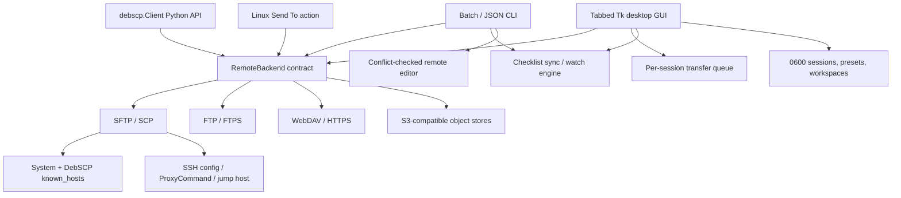

# DebSCP architecture

DebSCP preserves WinSCP's successful separation between user interfaces,
session orchestration, transfer policy, and protocol filesystems while using
portable Linux dependencies.

## Backend contract

`RemoteBackend` presents listing, upload, download, create, delete, rename, and
recursive tree operations. `BackendCapabilities` records download and upload resume separately, atomic-upload,
recursive, permission, and symlink behavior. Protocol adapters preserve native
semantics rather than claiming that FTP directories and S3 prefixes are POSIX
filesystems.

- SFTP uses Paramiko and implements identity-validated local temporary downloads
  and fresh remote temporary uploads followed by atomic rename.
- SCP uses the SCP data protocol while sharing the verified SSH connection and
  SFTP management where available, with SSH-command management fallback for SCP-only servers.
- FTP uses MLSD and REST; FTPS uses the platform CA trust store and encrypted
  data connections.
- WebDAV uses hardened XML parsing plus standard OPTIONS, PROPFIND, GET, ranged
  GET, PUT, MKCOL, MOVE and DELETE methods with TLS validation through Requests.
- S3 supports AWS and custom endpoints, paginated prefix browsing, multipart
  upload, ranged download, copy/delete rename, and recursive prefix operations.

## Higher-level services

`SyncEngine` first produces immutable `SyncAction` checklist items. The caller
can display or serialize that plan before applying it. Upload, download,
bidirectional, optional deletion, masks, and polling watch mode use the same
engine.

`RemoteEditor` downloads into an isolated temporary directory, waits for the
configured editor, verifies that the remote size/timestamp did not change, and
only then uploads the edited copy. `TransferPreset` centralizes include/exclude
glob policy. Session, preset, workspace, and private known-host stores use
owner-only permissions on Linux; passwords are kept out of profile JSON and
stored through the operating system credential service.

The GUI can keep multiple live connections and switch them through tabs.
Workspaces persist groups of profile names rather than credentials. CLI batch
mode, structured JSON, stable exit codes, and `debscp.Client` provide automation
without the Windows-only .NET process bridge.
