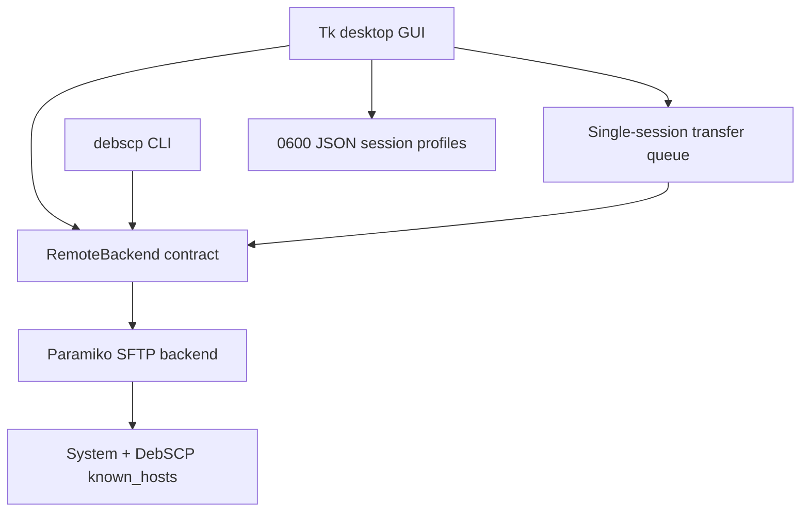

# DebSCP architecture

DebSCP keeps the successful separation found in WinSCP while using Linux-native
dependencies and a much smaller initial surface.

`RemoteBackend` is intentionally capability-neutral and small. A future
capability query should accompany additional protocols so the GUI never assumes
that object storage supports POSIX rename or that FTP supports SSH operations.

The first transfer queue uses one worker because Paramiko's SFTP client is not
treated as concurrently shareable. Future parallel transfers should allocate a
connection per worker and impose explicit connection/rate limits.

Passwords remain in memory. Profiles contain host, port, username, key path,
and initial remote path. Unknown SSH keys raise a typed error; only the GUI can
accept one after showing the fingerprint. CLI automation therefore fails safe.

