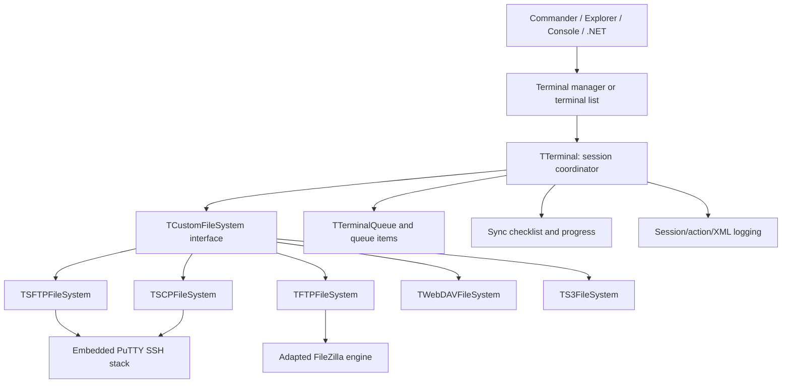

# WinSCP architecture study

This study is based on a source scan of `winscp/winscp` commit
`581da2d7983eab7fbeb95c80670c629e49bbe201` (15 August 2026). The checkout
contained 2,924 tracked files and approximately 367,280 lines across 566
C, C++, Pascal, and C# source/header files. Counts include bundled libraries.

## What WinSCP is

WinSCP is several products sharing one transfer engine:

1. A graphical Windows file manager with Commander (dual pane) and Explorer
   interfaces.
2. A console/scripting executable that exposes the same session and transfer
   concepts to batch automation.
3. A .NET automation assembly that drives a WinSCP child process and exchanges
   commands/results through an XML log protocol.
4. Windows integration: installer, shell/drag extension, URL/file associations,
   PuTTY integration, jump lists, notifications, and configuration migration.

Its public protocol set is SFTP, SCP, FTP/FTPS, WebDAV, S3, and local-to-local
operations. Its higher-level features include stored sites, workspaces,
background queues, keepalives, proxy/tunnel support, editing, masks, transfer
presets, synchronization, remote search, checksums, logging, and scripting.

## Source map

| Area | Approx. code lines | Responsibility |
|---|---:|---|
| `source/core` | 71,961 | Sessions, terminal orchestration, filesystem abstraction, protocols, queues, sync, scripts, configuration, logging |
| `source/putty` | 73,175 | Embedded/forked PuTTY SSH, keys, crypto, transport and terminal primitives |
| `source/forms` | 52,230 | VCL dialogs and the Explorer/Commander UI |
| `source/windows` | 30,510 | Windows GUI services, shell integration, configuration and managers |
| `source/filezilla` | 17,651 | Adapted FileZilla FTP implementation |
| `source/components` | 3,561 | WinSCP visual controls |
| `source/console` | 1,070 | Console entry point and command surface |
| `source/dragext` | 797 | Windows Explorer drag-and-drop shell extension |
| `source/packages` | 113,878 | Bundled third-party/component packages |
| `dotnet` | not included above | C# automation assembly and tests |

The build graph is expressed as Embarcadero `.cbproj` projects. `WinSCP.cbproj`
declares a C++ VCL application; the core build defines `WIN32`, `_WINDOWS`, and
other Windows-specific symbols. The documented toolchain requires Embarcadero
C++Builder 11 Professional and a batch-file build.

## Core execution model

### Sessions and configuration

`TSessionData` is the connection contract: protocol, host, credentials, SSH
options, proxy/tunnel settings, timeouts, paths, TLS settings, S3 settings, and
raw advanced options. `TConfiguration`, `TGUIConfiguration`, and
`TWinConfiguration` layer persistent core, GUI, and Windows-specific settings.
Stored sites and workspace state feed a terminal manager that can own multiple
live sessions.

### Terminal coordinator

`TTerminal` is the central façade between user-facing code and remote
filesystems. It opens/reconnects sessions, canonicalizes paths, caches directory
state, applies copy parameters, performs file operations, dispatches commands,
calculates checksums, drives synchronization, reports progress, and records
actions. UI and scripting code depend on this contract instead of calling a
protocol implementation directly.

### Protocol filesystem interface

`TCustomFileSystem` defines remote filesystem behavior. Implementations adapt
different wire protocols into common operations such as directory listing,
stat, copy, delete, rename, properties, links, checksums, space queries, remote
commands, and capability discovery. Capabilities matter because FTP, SCP, SFTP,
WebDAV, and object storage cannot truthfully expose identical semantics.

- SFTP and SCP are backed by WinSCP's PuTTY-derived SSH layer.
- FTP/FTPS is adapted from FileZilla code and integrates TLS libraries.
- WebDAV uses Neon plus TLS/XML dependencies.
- S3 maps object-store buckets, prefixes, multipart operations, credentials,
  regions, and signing into the filesystem façade.

### Transfers, queues, and progress

`TTerminalQueue` owns worker-thread execution. Specialized queue items cover
upload, download, local/remote deletion, connection bootstrap, and related
operations. Proxy/status objects let the UI observe state without directly
owning worker objects. Copy parameters centralize overwrite rules, resume,
preserving timestamps/permissions, text/binary handling, speed limits, masks,
and transfer presets.

### Synchronization

Synchronization is a compare-then-apply pipeline. Local and remote trees are
examined under timestamp/size/mask criteria; a `TSynchronizeChecklist` records
proposed uploads, downloads, and deletions; the GUI lets the user review it;
the terminal executes selected operations with progress and cancellation.
Keep-up-to-date adds local change monitoring and repeated reconciliation.

### UI and automation

`TCustomScpExplorerForm` supplies shared browser actions. `TScpCommanderForm`
and `TScpExplorerForm` provide the two main layouts. Dedicated forms cover
login, authentication, copying, progress, queue display, editing, preferences,
properties, remote find, masks, synchronization, URL generation, and advanced
site settings. `TTerminalManager` coordinates forms, tabs/sessions, transfer
queues, and editor downloads.

Console scripting parses commands and invokes the same terminal APIs. The .NET
assembly is deliberately process-based rather than a native library binding;
it starts WinSCP, submits commands, then interprets XML session/action logs.

## Why the original cannot become a `.deb` through recompilation

- The GUI is VCL, not a cross-platform toolkit.
- The supported compiler/build is proprietary Windows C++Builder.
- Source assumes Windows types, messages, registry, shell, COM, paths, and
  process behavior throughout core-adjacent layers.
- Bundled PuTTY/FileZilla forks and other libraries are integrated through
  Windows-specific adaptation code.
- Shell extension, .NET process automation, installer, update, drag-and-drop,
  and icon assets either have no Linux equivalent or need a new integration.
- WinSCP's icon set has additional licensing restrictions, so a derivative must
  not casually reuse its artwork in another application.

A safe port is a staged reimplementation around a portable backend contract,
native Linux UI/integration, and independently licensed artwork. DebSCP follows
that route and uses Paramiko/OpenSSH-compatible host keys for its first SFTP
backend instead of attempting to compile the WinSCP/PuTTY integration.

